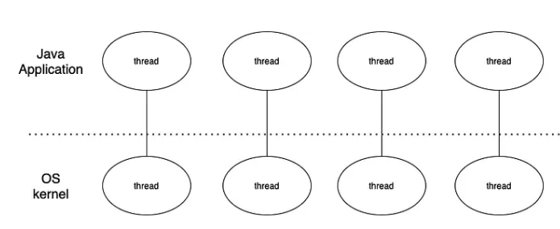
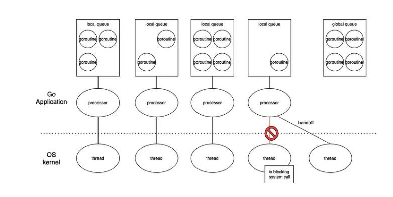

# How Goroutine Works

Let us start with some questions about Goroutine, 

1. Single-core CPU, open two Goroutines, one of which has an infinite loop, what will happen?
2. Processes and threads have IDs, why doesn't Goroutine have an ID?
3. How much is the right number of Goroutines, will it affect GC and scheduling?
4. What are the Goroutine leaks?
5. What can cause a Goroutine to hang?


At first, let us see how Java create threads (In Java 19, they add a new feature called Virtual Threads, this thing just works like Goroutine, so we just compare Go with old version Java).


### Java Thread

Java thread just use native thread provided by OS，and it related on OS  to scheduler.



Here is the Java code for 1000 threads. 

```java
public static void main(String []args) throws InterruptedException {
    for (int i = 0 ;i<1000;i++){
        new Thread(()->{
            try {
                Thread.sleep(100000000);
            } catch (InterruptedException e) {
                e.printStackTrace();
            }
        }).start();
    }
    Thread.sleep(100000000);
}
```

It will actually create 1000 threads (Java need some more threads, like for GC)

```
weiwensnagsang:~$ ps -T 100000 | wc -l1018
1018
```


In the best case, OS thread switching also requires the following operations,

1. CPU registers need to be saved and loaded.
2. The code of the system scheduler needs to be executed.
3. The CPU pipeline needs to be cleared.


The Java has been trying to optimize this problem. Because if a language wants to support high concurrency, the loss of thread switching is a serious bottleneck, and it will greatly drag down the corresponding time of the system as a whole.

In some extreme cases, the CPU may only spend 30% of its time on work, and the remaining 70% of its time is spent on creating, maintaining, and switching threads.


### Goroutine


Compared with Java using native threads and relying on the native scheduler of the OS to schedule, goroutine implements its own scheduler and schedules goroutines to execute between fixed threads by itself:


Here is the Go code for 1000 threads. 

```go
func doSomething() {
	time.Sleep(10 * time.Minute)
}

func main() {
	for i := 0; i < 100000; i++ {
		go doSomething()
	}

	time.Sleep(10 * time.Minute)

}
```


Thread will switch to another thread approximately every 10ms of executing a goroutine. And the priority order of thread picking goroutine is

1. goroutines in each thread's own queue
2. goroutines in the global queue
3. Stealing from other thread's queue (work-stealing)


How many threads for this Go code?

```
5
```


So far so good, but what if the thread gets stuck with a blocking system call (ex. reading a large file)? For example, in the figure below, there are three goroutines reading large files through the io system call. At this time, all goroutines will only rely on one thread for execution, which greatly reduces the utilization rate of the core.


In order to solve this problem, golang separates another layer of process between thread and goroutine as follows:


When a thread is blocked by the system call block, golang will create a new thread to take over the work of the processor, while the original thread will continue to execute the system call.




If we open 1000 goroutines to read a large file test, when Golang frequently opens goroutines to call blocking system calls, the number of threads created will probably be between **100 and 200**, which also shows that in some extreme cases, the concurrency of Go may It will degenerate to Java using native thread.


### GPM


